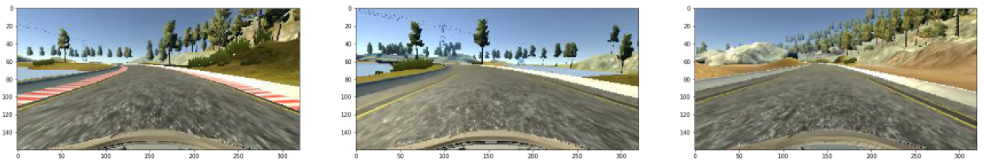
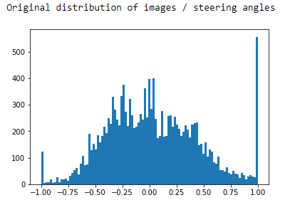

#**Behavioral Cloning** 

## Writeup Template


** Behavioral Cloning Project**

The goals / steps of this project are the following:
* Use the simulator to collect data of good driving behavior
* Build, a convolution neural network in Keras that predicts steering angles from images
* Train and validate the model with a training and validation set
* Test that the model successfully drives around track one without leaving the road
* Summarize the results with a written report

[//]: # (Image References)

[image1]: ./examples/placeholder.png "Model Visualization"
[image2]: ./examples/placeholder.png "Grayscaling"
[image3]: ./examples/placeholder_small.png "Recovery Image"
[image4]: ./examples/placeholder_small.png "Recovery Image"
[image5]: ./examples/placeholder_small.png "Recovery Image"
[image6]: ./examples/placeholder_small.png "Normal Image"
[image7]: ./examples/placeholder_small.png "Flipped Image"

## Rubric Points
### Here I will consider the [rubric points](https://review.udacity.com/#!/rubrics/432/view) individually and describe how I addressed each point in my implementation.  

---
### Files Submitted & Code Quality

#### 1. Submission includes all required files and can be used to run the simulator in autonomous mode

My project includes the following files:
* `model.py` containing the script to create and train the model
* `drive.py` for driving the car in autonomous mode
* `model.h5` containing a trained convolution neural network 
* `writeup_report.md` summarizing the results
* `behavioral-cloning.ipynb` used to actually write all the code and visualize the data

#### 2. Submission includes functional code
Using the Udacity provided simulator and my `drive.py` file, the car can be driven autonomously around the track by executing 
```sh
python drive.py model.h5
```

#### 3. Submission code is usable and readable

The `model.py` file contains the code for training and saving the convolution neural network. The file shows the pipeline I used for training and validating the model, and it contains comments to explain how the code works.

### Model Architecture and Training Strategy

#### 1. An appropriate model architecture has been employed

I started with the well-known nvidia architecture but eventually settled with a model which is quite similar to the one used for the traffic sign recognition (and probably has VGG as a close relative).

The model consists of three 5x5 convolutional layers with valid padding, stride 1, and 2x2 max-pooling, followed by three fully connected layers. The chosen activation function is relu. Also, dropout is used on the first two fully connected layers - see the `get_model()` function for all the details.

This mode has 27 million parameters whereas the nvidia model just has 1.5 million.


#### 2. Attempts to reduce overfitting in the model

The model contains two dropout layers in order to reduce overfitting. A dropout of 50% after the first fully connected layer, and a dropout of 25% after the second one.

THe model was trained and validated using data generated from different test drives to ensure that the model was not overfitting. I tested the model by running it through the simulator and ensuring that the vehicle could stay on the track.

#### 3. Model parameter tuning

The model used an adam optimizer, so the learning rate was not tuned manually (model.py line ???).

#### 4. Appropriate training data

First I chose to use the training data provided by udacity making up 8'036 samples. In addition I recorded 15'000 samples on track 1. Half of it in standard direction, and half of it in opposite direction. Having data driving the track in both directions should allow the model to generalize better. Most of the images are center lane driving but I intentionally added a couple of passages where I did not steer and then recovered using a steep steering angle.

### Model Architecture and Training Strategy

#### 1. Solution Design Approach

The overall strategy for deriving a model architecture was to ...

My first step was to use a convolution neural network model similar to the ... I thought this model might be appropriate because ...

In order to gauge how well the model was working, I split my image and steering angle data into a training and validation set. I found that my first model had a low mean squared error on the training set but a high mean squared error on the validation set. This implied that the model was overfitting. 

To combat the overfitting, I modified the model so that ...

Then I ... 

The final step was to run the simulator to see how well the car was driving around track one. There were a few spots where the vehicle fell off the track... to improve the driving behavior in these cases, I ....

At the end of the process, the vehicle is able to drive autonomously around the track without leaving the road.

####2. Final Model Architecture

The final model architecture (model.py lines 18-24) consisted of a convolution neural network with the following layers and layer sizes ...

Before the 320x160 images from the simulator are fed into the network, they are cropped to ???x???. Subsequently, local histogram optimization is applied to compensate dark low contrast situations which are often encountered on track 2.

_________________________________________________________________
Layer (type)                 Output Shape              Param #   
=================================================================
conv2d_1 (Conv2D)            (None, 76, 316, 32)       2432      
_________________________________________________________________
max_pooling2d_1 (MaxPooling2 (None, 38, 158, 32)       0         
_________________________________________________________________
conv2d_2 (Conv2D)            (None, 34, 154, 64)       51264     
_________________________________________________________________
max_pooling2d_2 (MaxPooling2 (None, 17, 77, 64)        0         
_________________________________________________________________
conv2d_3 (Conv2D)            (None, 13, 73, 128)       204928    
_________________________________________________________________
max_pooling2d_3 (MaxPooling2 (None, 6, 36, 128)        0         
_________________________________________________________________
flatten_1 (Flatten)          (None, 27648)             0         
_________________________________________________________________
dense_1 (Dense)              (None, 1000)              27649000  
_________________________________________________________________
dropout_1 (Dropout)          (None, 1000)              0         
_________________________________________________________________
dense_2 (Dense)              (None, 25)                25025     
_________________________________________________________________
dropout_2 (Dropout)          (None, 25)                0         
_________________________________________________________________
dense_3 (Dense)              (None, 1)                 26        
=================================================================

Total params: 27,932,675
Trainable params: 27,932,675
Non-trainable params: 0


Here is a visualization of the architecture (note: visualizing the architecture is optional according to the project rubric)

![alt text][image1]

#### 3. Creation of the Training Set & Training Process

I started out with the ??? training samples provided by udacity.



I couldn't manage to handle track 2 with those samples alone, thus I also recorded a few laps on the second track. 50% in default direction and 50% in the opposite direction - more on that in a minute.

The unfiltered data set is very much biased towards steering straight.



To counter this, I divided the absolute steering angle interval [0,1.2] into 1200 bins and chose at random at most 50 samples for each bin -- see `equalize_angles()`. Subsequently, I added images from the left and right camera with a steering correction of +10 degree and -10 degree, respectively -- see `select_cameras`.

TODO: Image of steering correction

Thus ending up with a distribution which is much more balanced.


Most of the data on track 1 is recorded driving a left turn, thus I randomly flipped the images (together with the steering angle) to avoid overfitting -- see `apply_random_flip_single()`.


To further counter the issue of steering angle bias and to help the model generalize, I also shifted the images from -80px to +80px where the amount was chosen from a uniform distribution, and corrected the steering angle accordingly -- see `apply_random_shifting_single()`.


While lighting on track 1 is quite uniform, track 2 has very dark and very bright spots. Therefore, I also applied random brightness augmentation to the pictures. To make the images brighter, I used gamma correction, to make them darker, I rescaled the v component in the hsv color space.


On track 2 shadows are abundant and very dark at times while on track 1 there are almost no shadows. To avoid overfitting and allow the network to generalize better to shadowish situations, I painted a black polygon with random edges and random alpha onto the pictures.


Before training, the unfiltered dataset was split 80/20 into training and validation sets, the steering angles were histogram equalized, and the set was shuffled. Augmentations such as using left and right cameras, random flipping, random shifting, random brightness, and random shadows were only applied on the training set.

| Training Set | Validation Set |
| ------------ | -------------- |
| X images     | Y images       |

To save memory and allow parallelization a python generator is used, yielding from list of image paths and steering angles batches of (augmented) images & steering angles -- see `generate_samples()`.

Every image of each of the sets is preprocessed by first selecting a horizontal slice from the image removing the car and most of the sky. Subsequently, skimage's local histogram optimization is applied to counter dark and low contrast situations. Then the image is fed into the network.  


The validation set helped me to determine when the model was overfitting. The ideal number of epochs was TODO 15-20 when the mse on the validation set dropped below 0.2. I used an adam optimizer so that manually training the learning rate wasn't necessary.
