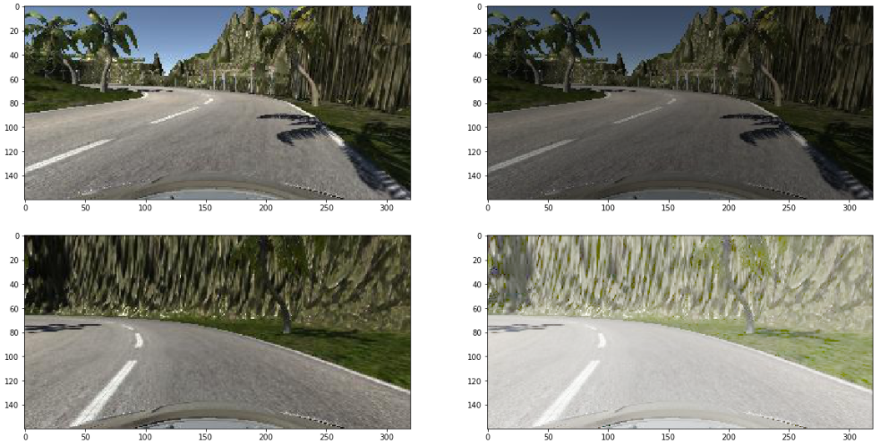
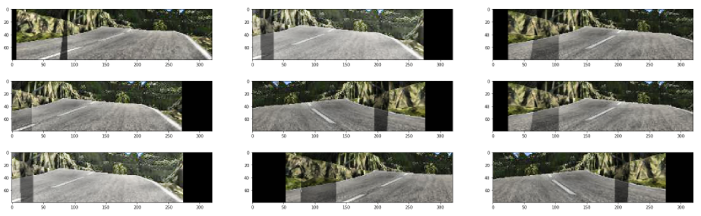

#**Behavioral Cloning** 

## Writeup Template


** Behavioral Cloning Project**

The goals / steps of this project are the following:
* Use the simulator to collect data of good driving behavior
* Build, a convolution neural network in Keras that predicts steering angles from images
* Train and validate the model with a training and validation set
* Test that the model successfully drives around track one without leaving the road
* Summarize the results with a written report

[//]: # (Image References)

[image1]: ./examples/placeholder.png "Model Visualization"
[image2]: ./examples/placeholder.png "Grayscaling"
[image3]: ./examples/placeholder_small.png "Recovery Image"
[image4]: ./examples/placeholder_small.png "Recovery Image"
[image5]: ./examples/placeholder_small.png "Recovery Image"
[image6]: ./examples/placeholder_small.png "Normal Image"
[image7]: ./examples/placeholder_small.png "Flipped Image"

## Rubric Points
### Here I will consider the [rubric points](https://review.udacity.com/#!/rubrics/432/view) individually and describe how I addressed each point in my implementation.  

---
### Files Submitted & Code Quality

#### 1. Submission includes all required files and can be used to run the simulator in autonomous mode

My project includes the following files:
* `model.py` containing the script to create and train the model
* `drive.py` for driving the car in autonomous mode
* `model.h5` containing a trained convolution neural network 
* `writeup_report.md` summarizing the results
* `behavioral-cloning.ipynb` used to actually write all the code and visualize the data

#### 2. Submission includes functional code
Using the Udacity provided simulator and my `drive.py` file, the car can be driven autonomously around the track by executing 
```sh
python drive.py model.h5
```

#### 3. Submission code is usable and readable

The `model.py` file contains the code for training and saving the convolution neural network. The file shows the pipeline I used for training and validating the model, and it contains comments to explain how the code works.

### Model Architecture and Training Strategy

#### 1. Solution Design Approach

The stages in which the CNN solution is built can be broken down into the usual ones: training, validation, and test -- see the diagram below. Data (camera images and steering angles) is generated using the simulator in 'training mode'. This data is preprocessed and split into training and validation sets. The training set is further augmented to counter several issues which I ran into when testing. Then the (augmented) training set is fed into the DNN for training. As a measure of progress, the DNN is tested against the validation set. When satisfied, the weights of the DNN are saved and used to run the simulator in 'autonomous mode'. There are two test tracks available where track 1 can be considered 'easier' than track 2.


I started with the well-known nvidia architecture and further evolved and adapted it to the problem at hand. The final model consists of 6 layers, three 5x5 convolutional layers, one 3x3 convolutional layer, and two fully connected layers - see the next section for further details.

For training, I first used only the training data provided by udacity making up 8'036 samples. This worked fine for track 1 but I couldn't get the model to generalized well enough to manage all of track 2 with that data. Thus, I recorded additional 6'000 samples on track 2. Half of it in standard direction, and the other half in opposite direction. Having data driving the track in both directions should allow the model to generalize better. 

This model has about 2 million parameters - slightly more than the 1.5 million parameters of the nvidia model which was built for a much more complex task (driving in real world scenarios).
To combat overfitting, I used dropout on the fully connected layers and augmented the training data by applying random flipping, random brightness, random shifting, and random shadows.

While training the network, I monitored the mean squared error on the augmented training set and the validation set. When the mse dropped below 0.03, the model was usually capable to drive both tracks without crashing.

#### 2. Final Model Architecture

The final model architecture is

| Layer      | Description                                           | Param #   |
|:----------:|:-----------------------------------------------------:|:---------:|
| Input      | 316x76x3 RGB image                                    | 0         |
| Conv2D 5x5 | 1x1 stride, valid padding, output (312, 72, 16), relu | 1'216     |
| MaxPool2D  | 2x2 stride, output (156, 36, 16)                      | 0         |
| Conv2D 5x5 | 1x1 stride, valid padding, output (152, 32, 32), relu | 12'832    |
| MaxPool2D  | 2x2 stride, output (76, 16, 32)                       | 0         | 
| Conv2D 5x5 | 1x1 stride, valid padding, output (72, 12, 64), relu  | 51'264    |
| MaxPool2D  | 2x2 stride, output (36, 6, 64)                        | 0         | 
| Conv2D 3x3 | 1x1 stride, valid padding, output (34, 4, 128), relu  | 73'856    |
| MaxPool2D  | 2x2 stride, output (17, 2, 128)                       | 0         | 
| Flatten    | output (27648)                                        | 0         | 
| Dense      | output (500), dropout = 50 %, relu                    | 2'176'500 |
| Dense      | output (20), dropout = 25 %, relu                     | 10'020    |
| Dense      | output (1)                                            | 21        |

Instead of resizing the images beforehand, the convolutional+maxpool layers gradually reduce the image size picking up features on the way. Relus introduce nonlinearity into the model and to avoid overfitting of the fully connected layers dropout is used -- see the `get_model()` function for all the details.

This model has about 2 million parameters - slightly more than the 1.5 million parameters of the nvidia model.

Before the 320x160 images from the simulator are fed into the network, they are cropped to 316x76 pixels. Initially the same cropping was used for training and testing in the simulator, cutting away the part of the vehicle visible in the pictures as well as most of the sky. However, I noticed that the steering got quite unstable at times. To make it easier for the model to predict a stable steering wheel, a different vertical slicing was chosen when testing to give the model a 'lookahead' advantage. After cropping, local histogram optimization is applied to compensate dark low contrast situations which are often encountered on track 2. These two steps make up all the preprocessing, everything else has been learned by the network.

The model used an adam optimizer, so the learning rate was not tuned manually.

Here is a visualization of the architecture


#### 3. Creation of the Training Set & Training Process

To be honest, I tried to provide only samples of center lane driving but had trouble to stay on course at time thus generating (unintentionally) several examples of recovering from deviations.

First I chose to use the training data provided by udacity making up 8'036 samples. In addition I recorded 15'000 samples on track 1. Half of it in standard direction, and half of it in opposite direction. Having data driving the track in both directions should allow the model to generalize better. Most of the images are center lane driving but I intentionally added a couple of passages where I did not steer and then recovered using a steep steering angle.

I started out with the ??? training samples provided by udacity.


I couldn't manage to handle track 2 with those samples alone, thus I also recorded a few laps on the second track. 50% in default direction and 50% in the opposite direction - more on that in a minute.

The unfiltered data set is very much biased towards steering straight.


To counter this, I divided the absolute steering angle interval [0,1.2] into 1200 bins and chose at random at most 50 samples for each bin -- see `equalize_angles()`. Subsequently, I added images from the left and right camera with a steering correction of +10 degree and -10 degree, respectively -- see `select_cameras`.


Thus ending up with a distribution which is much more balanced.


Most of the data on track 1 is recorded driving a left turn, thus I randomly flipped the images (together with the steering angle) to avoid overfitting -- see `apply_random_flip_single()`.


To further counter the issue of steering angle bias and to help the model generalize, I also shifted the images from -80px to +80px where the amount was chosen from a uniform distribution, and corrected the steering angle accordingly -- see `apply_random_shifting_single()`.


While lighting on track 1 is quite uniform, track 2 has very dark and very bright spots. Therefore, I also applied random brightness augmentation to the pictures. To make the images brighter, I used gamma correction, to make them darker, I rescaled the v component in the hsv color space.



On track 2 shadows are abundant and very dark at times while on track 1 there are almost no shadows. To avoid overfitting and allow the network to generalize better to shadowish situations, I painted a black polygon with random edges and random alpha onto the pictures.


Before training, the unfiltered dataset was split 80/20 into training and validation sets, the steering angles were histogram equalized, and the set was shuffled. Augmentations such as using left and right cameras, random flipping, random shifting, random brightness, and random shadows were only applied on the training set.

| Training Set | Validation Set |
| ------------ | -------------- |
| X images     | Y images       |

To save memory and allow parallelization a python generator is used, yielding from list of image paths and steering angles batches of (augmented) images & steering angles -- see `generate_samples()`.

Every image of each of the sets is preprocessed by first selecting a horizontal slice from the image removing the car and most of the sky. Subsequently, skimage's local histogram optimization is applied to counter dark and low contrast situations. Then the image is fed into the network.  



The validation set helped me to determine when the model was overfitting. The ideal number of epochs was TODO 15-20 when the mse on the validation set dropped below 0.2. I used an adam optimizer so that manually training the learning rate wasn't necessary.
